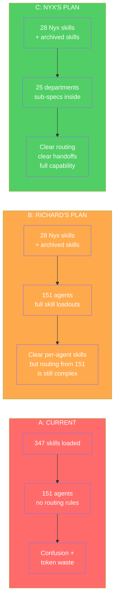
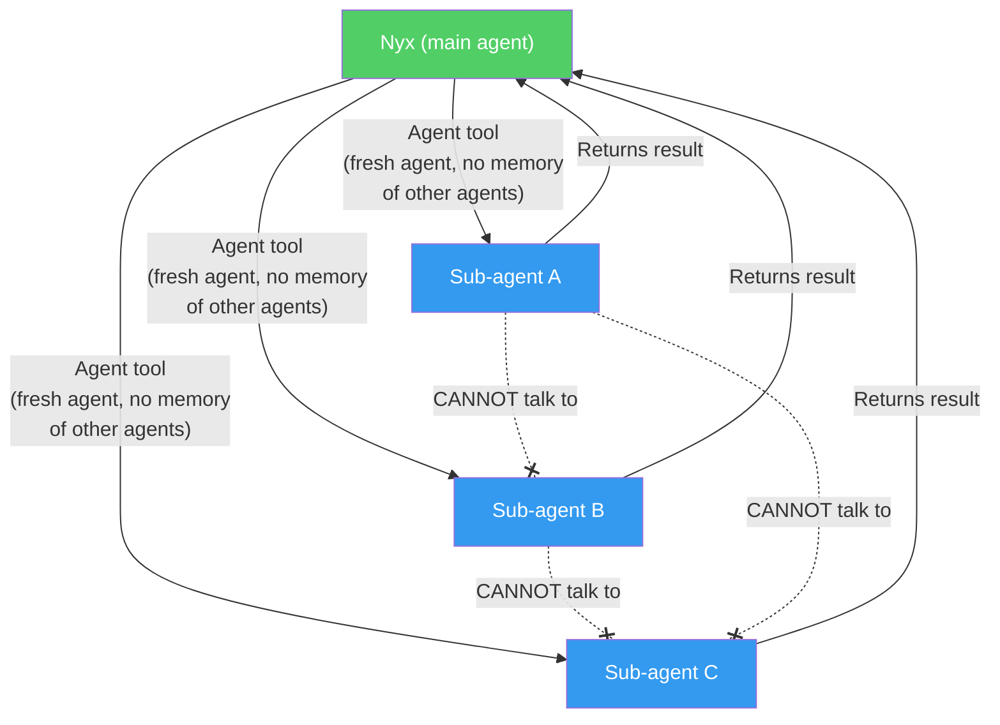

# Agent Workflow Comparison

Comparing three approaches to agent orchestration using the same scenario.

**Scenario:** *"Research our top 3 competitors in the AI agriculture space, write an analysis, create a blog post, and file everything in the wiki."*

This task touches: research, competitive analysis, writing, SEO, content marketing, and wiki management.

---

## Approach A — Current System (As-Is)

All 347 skills loaded into every session. Nyx picks from 151 agents or does it herself. No formal routing rules.

```mermaid
flowchart TD[[]()]()
    Captain["Captain gives task"]
    Nyx["Nyx\n(347 skills loaded)\n~16k tokens burned on skills alone"]
    
    Captain --> Nyx
    
    Nyx --> Q1{"Who handles research?\n10 research agents exist"}
    Q1 --> |"Pick one?"| A1["academic-researcher"]
    Q1 --> |"Or this one?"| A2["comprehensive-researcher"]
    Q1 --> |"Or this one?"| A3["competitive-intelligence-analyst"]
    Q1 --> |"Or this one?"| A4["research-coordinator"]
    Q1 --> |"Or maybe?"| A5["search-specialist"]
    
    A1 --> R1["Results come back"]
    A2 --> R1
    A3 --> R1
    A4 --> R1
    A5 --> R1
    
    R1 --> Q2{"Who writes the analysis?\nMultiple options again"}
    Q2 --> |"?"| B1["research-synthesizer"]
    Q2 --> |"?"| B2["knowledge-synthesizer"]
    Q2 --> |"?"| B3["technical-writer"]
    Q2 --> |"?"| B4["report-generator"]
    
    B1 --> R2["Analysis done"]
    B2 --> R2
    B3 --> R2
    B4 --> R2
    
    R2 --> Q3{"Blog post?\nMore overlap"}
    Q3 --> |"?"| C1["content-marketer"]
    Q3 --> |"?"| C2["content-curator"]
    Q3 --> |"?"| C3["social-media-copywriter"]
    
    C1 --> R3["Blog done"]
    C2 --> R3
    C3 --> R3
    
    R3 --> Nyx2["Nyx files in wiki\n(still has all 347 skills loaded)"]
    Nyx2 --> Done["Done — but which agents\nwere the RIGHT ones?"]
    
    style Nyx fill:#ff6b6b,color:#fff
    style Q1 fill:#ffa94d,color:#fff
    style Q2 fill:#ffa94d,color:#fff
    style Q3 fill:#ffa94d,color:#fff
    style Done fill:#ff6b6b,color:#fff
```

### Problems with Current System
- **Token waste:** 347 skills loaded = ~16k tokens burned before any work starts
- **Routing confusion:** 10+ research agents, which one? No clear rules
- **No handoff protocol:** Agents don't know about each other
- **Nyx overloaded:** Has every skill, tries to do everything herself

---

## Approach B — Richard's Plan (151 Agents, Full Skills, Agent Handoffs)

Each of the 151 agents gets a comprehensive skill loadout. Agents know their limits and signal when another agent should take over.

```mermaid
flowchart TD
    Captain["Captain gives task"]
    Nyx["Nyx\n(28 core EA skills)\nKnows all 151 agents"]
    
    Captain --> Nyx
    
    Nyx --> |"Competitive research needed"| CI["competitive-intelligence-analyst\nSkills: deep-research, competitive-ads-extractor,\ncompetitor-alternatives, perplexity, scrape, search"]
    
    CI --> |"Research complete.\nI can't write long-form analysis.\nHanding off to..."| CI_hand{"Agent signals handoff"}
    
    CI_hand --> |"But who?\nresearch-synthesizer?\nknowledge-synthesizer?\nacademic-research-synthesizer?"| Confusion1["3 similar agents\ncould take this"]
    
    Confusion1 --> |"Let's say..."| RS["research-synthesizer\nSkills: deep-research,\nwriting-clearly-and-concisely, doc-coauthoring"]
    
    RS --> |"Analysis done.\nNeed blog post.\nHanding off to..."| RS_hand{"Agent signals handoff"}
    
    RS_hand --> |"content-marketer?\ncontent-curator?\nsocial-media-copywriter?"| Confusion2["3 similar agents again"]
    
    Confusion2 --> |"Let's say..."| CM["content-marketer\nSkills: content-creator, copywriting,\nseo-fundamentals, social-content"]
    
    CM --> |"Blog done.\nNeed SEO check.\nHanding off to..."| CM_hand{"Agent signals handoff"}
    
    CM_hand --> SEO["seo-podcast-optimizer?\nseo-analyzer?\nseo-specialist?"]
    
    SEO --> |"SEO done"| Nyx2["Back to Nyx\nFiles in wiki, audits, reports"]
    
    Nyx2 --> Done["Done"]
    
    subgraph Problem ["THE PROBLEM"]
        direction LR
        P1["Agents CAN'T actually\ntalk to each other"]
        P2["Every 'handoff' goes\nthrough Nyx anyway"]
        P3["151 routing choices\n= decision fatigue"]
    end
    
    style Nyx fill:#51cf66,color:#fff
    style CI fill:#339af0,color:#fff
    style RS fill:#339af0,color:#fff
    style CM fill:#339af0,color:#fff
    style Confusion1 fill:#ffa94d,color:#fff
    style Confusion2 fill:#ffa94d,color:#fff
    style SEO fill:#ffa94d,color:#fff
    style Problem fill:#ff6b6b,color:#fff
    style P1 fill:#ff6b6b,color:#fff
    style P2 fill:#ff6b6b,color:#fff
    style P3 fill:#ff6b6b,color:#fff
```



### What Works
- Nyx is lean (28 skills) — token cost down
- Each agent has the right tools for their job
- Skill overlap between agents is fine
- Comprehensive coverage

### What Doesn't
- **151 routing choices** — Nyx still has to pick from too many similar agents
- **Handoff is an illusion** — technically, every agent reports back to Nyx. Agents can't spin up other agents. So "agent handoff" is really "Nyx orchestrates a chain"
- **Overlap confusion** — 10 research agents, 3 content agents, 3 SEO agents... which one for this task?
- **Maintenance burden** — 151 agent profiles to keep skill mappings updated

---

## Approach C — Nyx's Plan (25 Departments, Nyx Orchestrates Relay)

Consolidate 151 agents into ~25 departments. Each department has clear boundaries, comprehensive skills, and explicit handoff triggers. Nyx orchestrates the relay. Original agent profiles kept as reference for sub-specialization.

```mermaid
flowchart TD
    Captain["Captain gives task"]
    Nyx["Nyx (EA)\n28 core skills\n25 departments to choose from\nClear routing rules"]
    
    Captain --> Nyx
    
    Nyx --> |"Step 1: Research needed\nDepartment: Research & Intelligence"| RESEARCH
    
    subgraph RESEARCH ["DEPT: Research & Intelligence"]
        direction TB
        RA["Agent type: research-analyst\n\nSkills: deep-research, perplexity, scrape, search,\ncompetitive-ads-extractor, competitor-alternatives,\ncontent-research-writer, brainstorming\n\nSub-specs available:\n- competitive-intelligence-analyst.md\n- academic-researcher.md\n- search-specialist.md\n(read from agents/ if needed)"]
    end
    
    RESEARCH --> |"Research complete\nReports to Nyx"| Nyx_R["Nyx reviews & audits"]
    
    Nyx_R --> |"Step 2: Write analysis\nDepartment: Writing & Documentation"| WRITING
    
    subgraph WRITING ["DEPT: Writing & Documentation"]
        direction TB
        TW["Agent type: technical-writer\n\nSkills: writing-clearly-and-concisely,\nprofessional-communication, obsidian-markdown,\ndoc-coauthoring, mermaid-diagrams\n\nSub-specs available:\n- knowledge-synthesizer.md\n- research-synthesizer.md\n- report-generator.md"]
    end
    
    WRITING --> |"Analysis complete\nReports to Nyx"| Nyx_W["Nyx reviews & audits"]
    
    Nyx_W --> |"Step 3: Blog + SEO\nDepartment: Content & Marketing"| CONTENT
    
    subgraph CONTENT ["DEPT: Content & Marketing"]
        direction TB
        CMK["Agent type: content-marketer\n\nSkills: content-creator, copywriting,\nseo-fundamentals, seo-optimizer, social-content,\nemail-sequence, marketing-strategy-pmm\n\nSub-specs available:\n- seo-specialist.md\n- social-media-copywriter.md\n- content-curator.md"]
    end
    
    CONTENT --> |"Blog + SEO done\nReports to Nyx"| Nyx_C["Nyx reviews & audits"]
    
    Nyx_C --> |"Step 4: Nyx files in wiki\n(her core domain — does it herself)"| WIKI["Nyx uses her own skills:\nobsidian-markdown, obsidian-bases\n\nCreates/updates:\n- wiki/sources/ page\n- wiki/entities/ pages\n- wiki/analyses/ page\n- index.md\n- log.md"]
    
    WIKI --> Report["Nyx reports to Captain:\n'Done. 3 competitors analyzed.\nAnalysis filed. Blog ready.\nHere's the summary.'"]
    
    Report --> Captain_Done["Captain reviews"]
    
    style Nyx fill:#51cf66,color:#fff
    style RESEARCH fill:#e7f5ff,stroke:#339af0
    style WRITING fill:#fff3bf,stroke:#fab005
    style CONTENT fill:#d3f9d8,stroke:#40c057
    style Nyx_R fill:#51cf66,color:#fff
    style Nyx_W fill:#51cf66,color:#fff
    style Nyx_C fill:#51cf66,color:#fff
    style WIKI fill:#845ef7,color:#fff
    style Report fill:#51cf66,color:#fff
```



### What Works
- **Clear routing:** 25 departments, not 151 agents — Nyx picks fast
- **No overlap confusion:** One department per domain, sub-specs inside
- **Real handoffs:** Nyx orchestrates the relay, audits between each step
- **Full capability preserved:** Original 151 agent profiles still available as sub-specialization references
- **Lean tokens:** Only 28 skills loaded, rest pulled from archive per-agent
- **Scalable:** New skills/agents go INTO a department, not as standalone entries

### What's Different from Richard's Plan
- Agents don't "hand off" to each other — Nyx runs the relay explicitly
- 25 routing choices instead of 151
- Sub-specialization happens via agent profile reference, not separate agents

---

## Side-by-Side Comparison



| Factor | A: Current | B: Richard's Plan | C: Nyx's Plan |
|--------|-----------|-------------------|---------------|
| Skills loaded per session | 347 (~16k tokens) | 28 (~1.5k tokens) | 28 (~1.5k tokens) |
| Routing choices for Nyx | 151 agents | 151 agents | 25 departments |
| Agent-to-agent handoff | None | Desired but not technically possible | Nyx-orchestrated relay (actually works) |
| Skill coverage | All loaded (wasteful) | All mapped to agents (comprehensive) | All mapped to departments (comprehensive) |
| Original 151 agents | All active | All active | Preserved as sub-spec references |
| Skills lost | None | None | None |
| Maintenance effort | Low (dump everything in) | High (151 profiles) | Medium (25 dept docs) |
| Routing accuracy | Low (too many choices) | Medium (overlap confusion) | High (clear boundaries) |
| Parallel execution | Possible but uncoordinated | Possible, Nyx coordinates | Possible, Nyx coordinates |
| Scalability | Gets worse over time | Gets worse (more agents) | Stays clean (add to departments) |

---

## The Key Technical Constraint

No matter which plan we choose, this is how Claude Code actually works:



**Agents never talk to each other. Every handoff goes through Nyx.** This is true for ALL three plans. The question is just how Nyx organizes her routing decisions.
